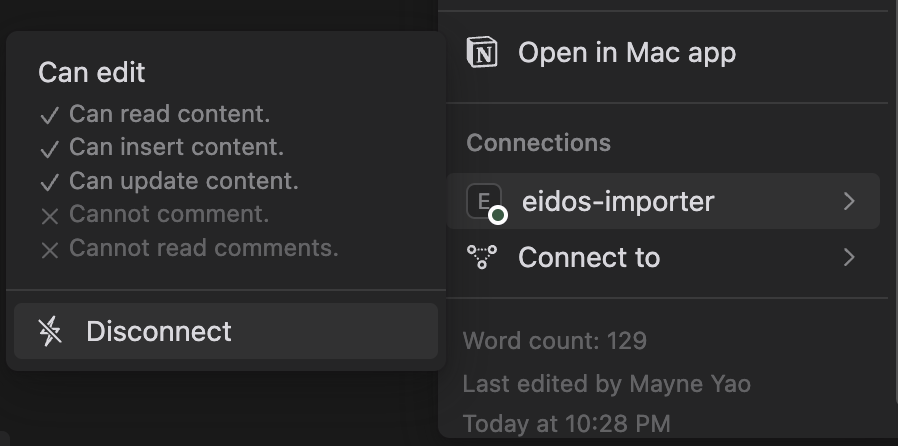
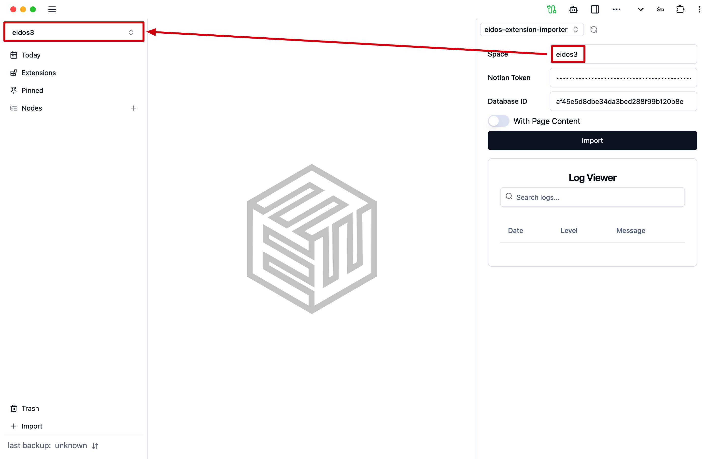

# Eidos-Extension-Importer

Eidos-Extension-Importer is an extension of Eidos, designed to import data from various sources, including Notion, Airtable, and more. It is the first extension that explores the design of SDKs for Eidos.

## Notion

### How to use

1. create an integration in Notion https://www.notion.so/my-integrations, get the `Internal Integration Secret`
2. connect to pages you want to import
   1. 
3. go to [release page](https://github.com/mayneyao/eidos-extension-importer/releases) and download the latest release (looks like `build-v0.x.x.zip`)
4. open you Eidos, open the side panel 
5. select the zip file you downloaded, it should be installed and loaded automatically. if not, try to reload the page
6. config the importer
   1. `space` is the target space in Eidos, not the space name of Notion 
   2. the token is the `Internal Integration Secret` you got from step 1
   3. find the `databaseId` from the URL of the page you want to import. for example: `https://www.notion.so/gine/Elden-Ring-The-Notion-Wiki-2037fda161a94b188103fa6db7d22919` => `2037fda161a94b188103fa6db7d22919`
      1. it only supports databases yet, if you want to import a page, you need to move the page into a database

### Field Support

- [x] Title
- [x] Text
- [x] Number
- [x] Select
- [x] Multi-Select
- [x] Date
- [ ] Person
- [ ] File
  - [ ] image
    - [ ] upload
    - [x] external
  - [ ] others
- [x] Checkbox
- [x] URL
- [x] Email
- [x] Phone Number
- [ ] Formula
  - [x] will be mapped to text
- [ ] Relation
- [ ] Rollup
- [ ] Created Time
- [ ] Created By
- [ ] Last Edited Time
- [ ] Last Edited By
- [ ] Auto Number

### Subpage Support

only support standard markdown elements

- [x] Heading
- [x] Quote
- [x] Divider
- [x] Code
- [x] Image
  - [x] Notion hosted
  - [ ] External
